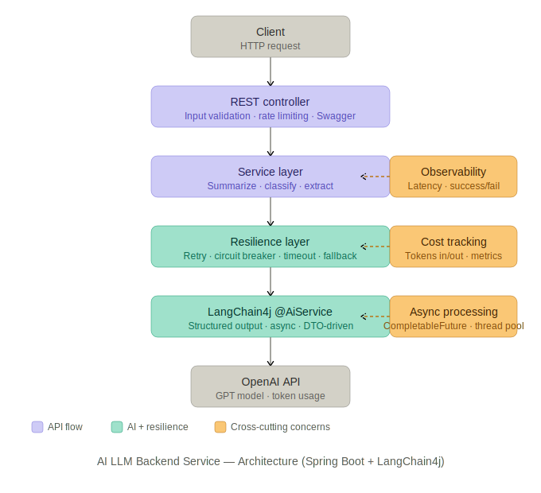
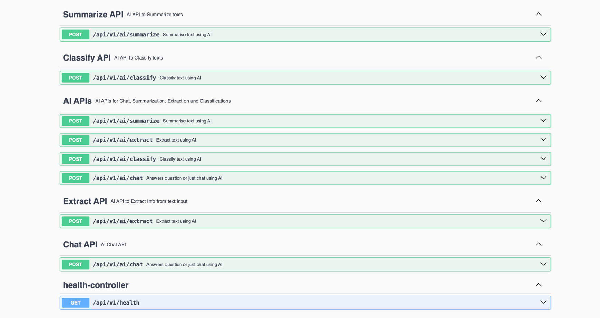
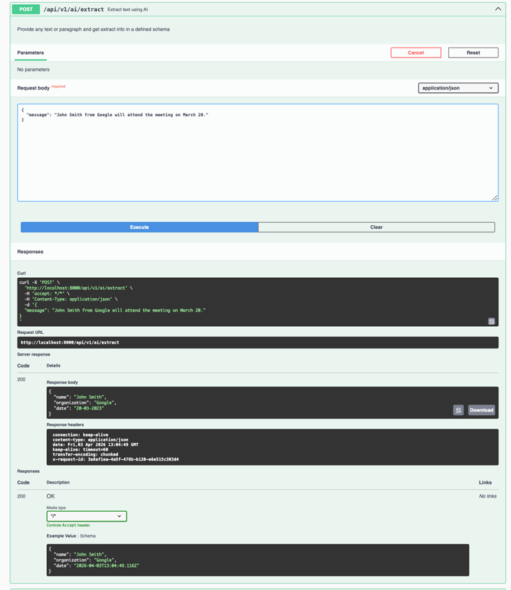
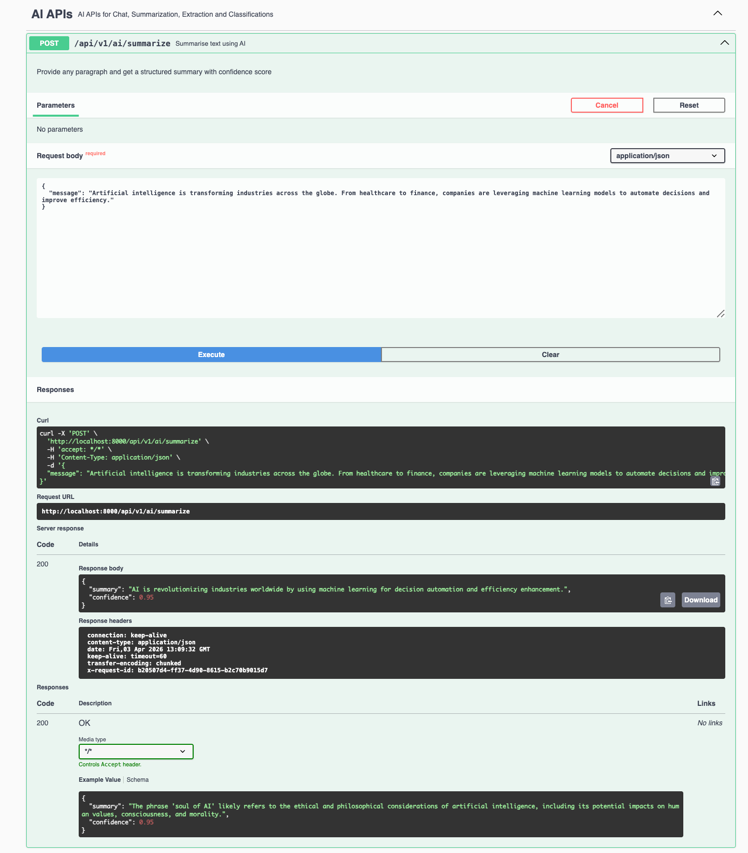

# 🚀 AI LLM Backend Service (Spring Boot + LangChain4j)

## 📌 Overview

This project demonstrates how to integrate **Large Language Models (LLMs)** into a **production-ready backend service** using Spring Boot.

It provides REST APIs for:
- Text Summarization
- Text Classification
- Structured Data Extraction

The system is designed with a strong focus on:
- reliability
- structured outputs
- fault tolerance
- clean backend architecture
- observable
- cost metrics visibility
---

## 🧠 Why This Project?

Most AI demos focus only on calling APIs.

This project focuses on:
> **building a reliable backend system that integrates AI as a dependency with reliability, observability, and cost-awareness**

It treats LLMs like any external service (e.g., payment gateway), handling:
- failures
- latency
- retries
- validation

---

## ⚙️ Features

- ✅ LLM integration using LangChain4j (`@AiService`)
- ✅ Structured JSON responses (DTO-based)
- ✅ Resilience4j:
  - Retry
  - Circuit Breaker
  - Timeout
- ✅ Observability:
  - Latency tracking
  - Success / failure metrics
  - Tagged metrics (operation, model)
- Actuator integration
- 💰 Token & Cost Tracking
  -  Input tokens
  -  Output tokens
  - Total tokens
  - Cost per request
  - Cost calculation abstraction (CostCalculator)
- ✅ Asynchronous processing using `CompletableFuture`
- ✅ Input validation (`@NotBlank`, `@Size`)
- ✅ Global exception handling
- ✅ Request tracing with `requestId`
- ✅ Rate limiting filter
- ✅ Centralized thread pool (Executor)
- ✅ Swagger (OpenAPI) for API testing

---

## 🏗️ Architecture



### Key Design Principles

- **Separation of concerns** (Controller → Service → LLM)
- **LLM treated as external dependency**
- **Structured outputs over raw text**
- **Resilience-first design**

---
## 🎬 Demo

### API Endpoints (Swagger UI)



### Extract — Structured Data from Natural Language
**Request**
```json
{
  "message": "John Smith from Google will attend the meeting on March 20 2023."
}
```

**Response**
```json
{
  "name": "John Smith",
  "organization": "Google",
  "date": "20-03-2023"
}
```


### Summarize — AI-Generated Summary

**Request**
```json
{
  "message": "Artificial intelligence is transforming industries across the globe. From healthcare to finance, 
  companies are leveraging machine learning models to automate decisions and improve efficiency."
}
```

**Response**
```json
{
  "summary": "AI is revolutionizing industries worldwide by using machine learning for decision automation and efficiency enhancement.",
  "confidence": 0.95
}
```



---

## 📡 API Endpoints

### 1. Summarize Text
POST /api/v1/ai/summarize

### 2. Classify Text
POST /api/v1/ai/classify

### 3. Extract Structured Data
POST /api/v1/ai/extract

---

## 📥 Example Request

```json
{
  "message": "John Smith from Google will attend the meeting on March 20."
}
```

---

## 📤 Example Response (Extract)

```json
{
  "name": "John Smith",
  "organization": "Google",
  "date": "March 20"
}
```
---
# 📊 Metrics & Monitoring
## Base Endpoint
  /actuator/metrics

---
# Key Metrics
* ai.latency
* ai.requests.success
* ai.requests.failure
* ai.tokens.input
* ai.tokens.output
* ai.tokens.total
* ai.cost.total

---
# 🔍 Filter Metrics by Operation

/actuator/metrics/ai.latency?tag=operation:summarise

---
# 💰 Cost Calculation

***Cost is computed using token usage:***

cost = (inputTokens × inputRate) + (outputTokens × outputRate)

Example pricing:
* Input: $0.005 / 1K tokens
* Output: $0.015 / 1K tokens
---
## 📘 API Documentation

Swagger UI available at:
http://localhost:8080/swagger-ui.html

---

## ▶️ How to Run

### 1. Clone the repository

```bash
git clone https://github.com/PammyS/AI-LLM.git
cd AI-LLM
```

### 2. Set environment variable

```bash
export OPENAI_API_KEY=your_api_key
```

### 3. Run the application

```bash
./mvnw spring-boot:run
```

### 4. Test APIs

Open Swagger UI:
http://localhost:8080/swagger-ui.html

---

## 🧩 Design Decisions

### 1. Why `@AiService` (LangChain4j)?
- Provides clean abstraction over raw API calls
- Reduces boilerplate
- Ensures type-safe responses

### 2. Why Structured JSON Output?
- Avoids unreliable free-text responses
- Enables safe parsing into DTOs
- Makes AI usable in backend workflows

### 3. Why Resilience4j?
LLMs are:
- slow
- rate-limited
- occasionally unreliable

Resilience4j ensures:
- retries on transient failures
- circuit breaking on repeated failures
- timeout protection

### 4. Why Async Processing?
- Prevents blocking request threads
- Improves scalability under load
- Enables better resource utilization

### 5. Why Fallback Responses?
Instead of failing requests:
- system returns safe defaults
- ensures graceful degradation

### 6. Why Observability?
Without metrics:
* AI = black box ❌

With metrics:
* latency tracking
* failure analysis
* performance tuning ✅

### 7. Why Cost Tracking?

LLMs introduce real cost per request.

Tracking enables:
* budget control
* optimization decisions
* production readiness

---

## 🚀 Future Improvements

- Prompt externalization & versioning
- Response caching (Redis)
- Multi-model support
- RAG (Retrieval-Augmented Generation)
- Advanced observability (Prometheus + Grafana)

---

## 🧪 Tech Stack

- Java 17+
- Spring Boot
- LangChain4j
- Resilience4j
- Micrometer + Actuator
- Jackson
- OpenAI API
- Swagger (OpenAPI)

---

## 👨‍💻 Author

Perminder Singh

Backend Engineer with 10+ years of experience, now exploring production-grade AI systems.

---

## ⭐ Key Takeaway

This project demonstrates:

> How to build a **reliable, observable, and cost-aware production-style backend system that integrates AI**, not just call an API.
